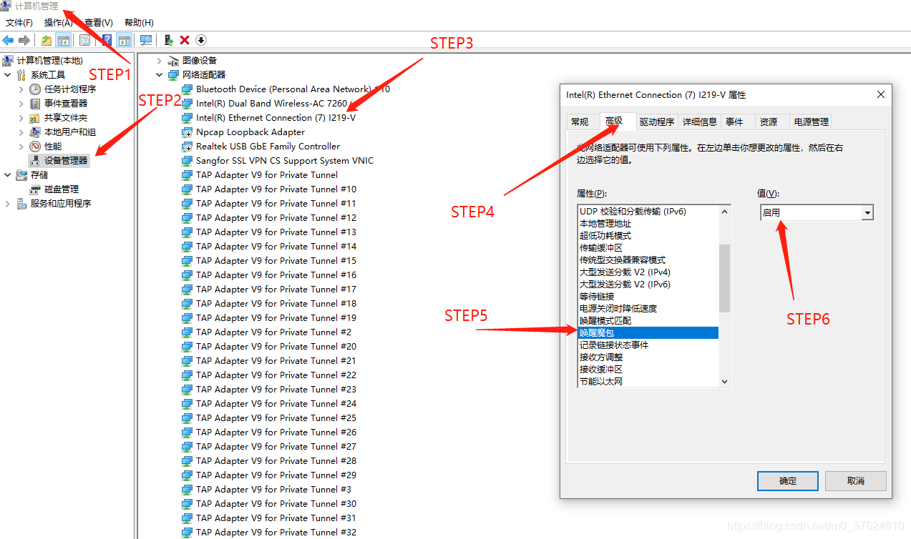
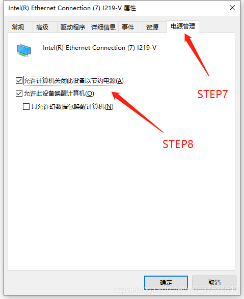
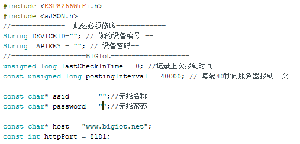
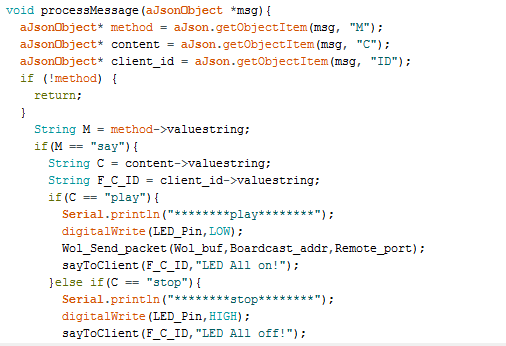
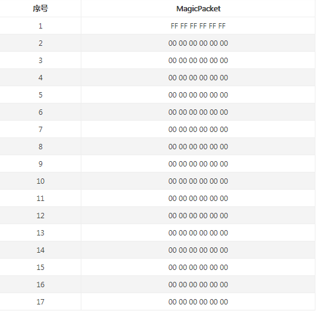

# esp8266+贝壳物联+Wol(wake on lan)实现远程开机 #
#ESP8266 通过贝壳物联 远程开机（WOL）#

----------

## 所需材料 ##
- Wifi模块（我使用的是ESP8266，用arduino编译比较简单，其他的模块原理差不多）
- 支持Wol的网卡设备

## 1、基础设置 ##
### 1.1 Wake on lan 设置 ###
- 开机时进入bios，打开PCI-E设备唤醒（每个主板都不同，自行百度）
- 进入windows 启用网卡的magic packet 
- 有些网卡需要更新驱动才会显示这些选项
- 
- 
- ==================（懒，图用的别人的）====================
### 1.2 查看本机信息 ###
- win+R 运行cmd，输入ipconfig /all 查看IP地址和mac地址
- 尽量绑定为静态IP，以免改变后需要再次下载程序

### 1.3 测试Wol是否成功 ###
- 随意在其他设备下载wol唤醒的app
- 填写上一步查看到的ip和mac地址,默认9号端口即可
- 
- 配置好后 尝试是否成功
- 成功后往下看

----------

## 2、写入程序编写的wol代码到esp8266 ##
### 2.1 贝壳物联设置 ###
- 注册贝壳物联
- 注册后添加设备和数据接口
- 使用贝壳物联官网的示例
- 更改wifi账户密码和添加的设备ID和api
- 
- **在processmessage函数中可自定义发送来的消息处理**
- 
- 上图所示，当接收到play时，发送magicpacket数据包
- 其他可自己拓展
### 2.2 发送magicPacket数据包 ###
- magicPacket数据包格式十分简单
- 假设MAC地址为 00:00:00:00:00:00
- 
- 使用udp发送数据包即可实现开机
### 2.3 代码 ###
#### PowerOn.ino ####
    #include "Auto_PowerOn.h"
    #include <ESP8266WiFi.h>
    #include <aJSON.h>
    //=============  此处必须修该============
    String DEVICEID=""; // 你的设备编号 ==
    String  APIKEY = ""; // 设备密码==
    //==================BIGIot===================
    unsigned long lastCheckInTime = 0; //记录上次报到时间
    const unsigned long postingInterval = 40000; // 每隔40秒向服务器报到一次
    
    const char* ssid = "";//无线名称
    const char* password = "";//无线密码
    
    const char* host = "www.bigiot.net";
    const int httpPort = 8181;
    
    //===================Led=================
    int LED_Pin = D6;
    void setup() {
      Serial.begin(115200);
      delay(1000);
      pinMode(LED_Pin,OUTPUT);
      digitalWrite(LED_Pin,HIGH);
      WiFi.begin(ssid, password);
      Wol_Init(Wol_buf,Pc_mac,Local_port);
    }
    
    WiFiClient client;
    
    void loop() {
    
      while (WiFi.status() != WL_CONNECTED) {
    delay(1000);
    Serial.print(".");
      }
    
      // Use WiFiClient class to create TCP connections
      if (!client.connected()) {
    if (!client.connect(host, httpPort)) {
      Serial.println("connection failed");
      delay(5000);
      return;
    }
      }
    
      if(millis() - lastCheckInTime > postingInterval || lastCheckInTime==0) {
    checkIn();
      }
      
      // Read all the lines of the reply from server and print them to Serial
      if (client.available()) {
    String inputString = client.readStringUntil('\n');
    inputString.trim();
    Serial.println(inputString);
    int len = inputString.length()+1;
    if(inputString.startsWith("{") && inputString.endsWith("}")){
      char jsonString[len];
      inputString.toCharArray(jsonString,len);
      aJsonObject *msg = aJson.parse(jsonString);
      processMessage(msg);
      aJson.deleteItem(msg);  
    }
      }
    }
    
    void processMessage(aJsonObject *msg){
      aJsonObject* method = aJson.getObjectItem(msg, "M");
      aJsonObject* content = aJson.getObjectItem(msg, "C"); 
      aJsonObject* client_id = aJson.getObjectItem(msg, "ID");
      if (!method) {
    return;
      }
    String M = method->valuestring;
    if(M == "say"){
      String C = content->valuestring;
      String F_C_ID = client_id->valuestring;
      if(C == "play"){
    Serial.println("********play********");
    digitalWrite(LED_Pin,LOW);
    Wol_Send_packet(Wol_buf,Boardcast_addr,Remote_port);
    sayToClient(F_C_ID,"LED All on!");
      }else if(C == "stop"){
    Serial.println("********stop********");
    digitalWrite(LED_Pin,HIGH);
    sayToClient(F_C_ID,"LED All off!");
      }else{
    int pin = C.toInt();
    Serial.println("********show********"); 
    sayToClient(F_C_ID,"LED pin:"+pin); 
      }
    }
    }
    
    void checkIn() {
    String msg = "{\"M\":\"checkin\",\"ID\":\"" + DEVICEID + "\",\"K\":\"" + APIKEY + "\"}\n";
    client.print(msg);
    lastCheckInTime = millis(); 
    }
    
    void sayToClient(String client_id, String content){
      String msg = "{\"M\":\"say\",\"ID\":\"" + client_id + "\",\"C\":\"" + content + "\"}\n";
      client.print(msg);
      lastCheckInTime = millis();
    }
#### AutoPowerOn.h ####
    #include <WiFiUdp.h>
	//=====================Wol=================
    char Wol_buf[102];//前6为ff,后面都为MAC地址 16*{0xAA,0xAA,0xAA,0xAA,0xAA,0xAA}
    char Pc_mac[6] = {0xAA,0xAA,0xAA,0xAA,0xAA,0xAA};
    const char * Boardcast_addr = "192.168.1.255";//广播地址
    unsigned int Remote_port = 9;
    unsigned int Local_port = 9;
    WiFiUDP Udp;
    
    void Wol_Init(char Wol_buf[102],char Pc_mac[6],unsigned int Local_port){
      int i,j;
      Udp.begin(Local_port);
      for(i=0;i<6;i++){
    Wol_buf[i]=0xff;
      }
      for(i=1;i<17;i++){
    for(j=0;j<6;j++){
      Wol_buf[i*6+j] = Pc_mac[j];
    }
      }
      #ifdef wol_debug
      Serial.println("Wol package is:") 
      for(i=0;i<102;i++){
    Serial.print("%x ",Wol_buf[i]);
    if(i%6 == 0)
      Serial.print("\n");
      }
      #endif
    }
    
    void Wol_Send_packet(char Wol_buf[102],const char * Boardcast_addr,unsigned int Remote_port){
      Udp.beginPacket(Boardcast_addr,Remote_port);
      Udp.write(Wol_buf);
      Udp.endPacket();
    }
